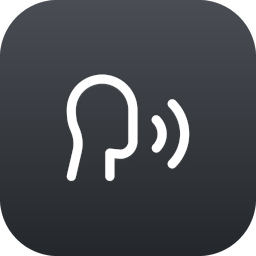

<p align="center">
  
</p>

# yap

Dictation and meeting transcription for macOS, all of it on your Mac.

Hold a key, talk, let go. The text turns up at your cursor about 60 ms later.
No account, no upload. The network gets used once, to fetch the model.

## Install

```sh
brew install --cask terrifiedbug/tap/yap
yap setup
```

`yap setup` asks for the permissions and pulls the model down. That is 220 MB,
once, and then you are offline forever.

Builds are signed with a Developer ID certificate and notarized by Apple, so
there is no Gatekeeper prompt. Apple Silicon only, because the model runs on
the Neural Engine.

## Use

Hold `fn`, speak, release. A small pill shows up while the mic is live, and the
same mark sits in the menu bar the whole time yap is running.

```sh
yap install --launch-at-login   # menu bar, back after every login
yap                             # foreground instead, dies with the terminal
yap record                      # record a meeting now, ^C to stop
yap doctor                      # permissions, key mapping, model
```

Dictation and the meeting recorder share one process and one loaded model. The
recorder takes your mic and the system audio as two separate tracks and gives
you one transcript, with timings and speaker labels.

If `fn` does something else on your Mac, `yap doctor` says how to get it back.
There is also `--hotkey`, and `dictation.hotkey` in the config file.

"Copy last transcript" in the menu bar is there for the press that landed in
the wrong window. yap holds the most recent one in memory and nowhere else.

"Quit yap" stops the background daemon until your next login. `yap start`
brings it back sooner.

| | |
|---|---|
| `yap run` | The daemon, in the foreground. The default. |
| `yap start` / `yap stop` | Start or stop the background daemon. |
| `yap record` | Record one session now, then transcribe it. |
| `yap models list` | The models, and which ones you have. |
| `yap models download <id>` | Fetch one early. |
| `yap doctor` | Permissions, key mapping, model, login item. |
| `yap setup` | Permissions and the model, in one go. |
| `yap install` | Add or remove the login item. |
| `yap bench --audio FILE` | Time it on your own audio. |
| `yap --version` | Print the version. |

## Configuration

`~/.config/yap/config.json`. Every key is optional and a flag beats the file.
"Edit config…" in the menu bar opens it, filled in with the defaults.

```json
{
  "recordings_dir": "~/Recordings",
  "meeting_detection": false,
  "mic_voice_processing": true,
  "on_stop": "my-hook",
  "transcription": { "enabled": true },
  "dictation": {
    "model": "parakeet-tdt-ctc-110m",
    "hotkey": "fn",
    "overlay": true,
    "newline_after_release": false,
    "mute_output": false
  }
}
```

Save it and yap picks it up. The hotkey, the overlay, `mute_output`,
`newline_after_release` and `meeting_detection` all change on the spot. A new
`model` or `recordings_dir` wants a restart, and yap says so when it sees one.

`newline_after_release` hits Return once the text is in, which is what you want
for chat boxes.

`mute_output` silences the speakers while the key is down. Your mic hears the
room and the room includes whatever you are playing, so a video behind a press
gets transcribed along with you. Off by default because you can hear it happen.

`meeting_detection` offers to record when something else grabs the mic. Off by
default, and nothing is watching until you turn it on.

`mic_voice_processing` cancels speaker echo on the mic track. On by default: a
call coming out of your speakers goes back into the mic. Without it, the other
side gets transcribed twice, the second time as you. If some audio route
returns silence instead, yap notices inside a second and restarts the mic raw.

`on_stop` runs a command after each recording with the session folder as its
argument.

`transcription` is automatic transcription of recordings, on by default.
Dictation ignores it, since the hotkey always transcribes. Turn it off to use
yap as a plain recorder: `on_stop` then fires when the recording stops rather
than after the transcript. Nothing is lost either way. Turn it back on, restart,
and yap works through every session under `recordings_dir` that has no
transcript yet, firing `on_stop` again for each. Anything you put somewhere else
with `yap record --out` is left alone.

## Models

| id | languages | size | default |
|---|---|---|---|
| `parakeet-tdt-ctc-110m` | English | 220 MB | ★ |
| `parakeet-tdt-0.6b-v2` | English | 465 MB | |
| `parakeet-tdt-0.6b-v3` | 25 languages | 500 MB | |

The default is the small one. Set `model` in the config file if you want a
different one. Numbers behind that choice are in
[docs/benchmarks.md](docs/benchmarks.md).

They live in the shared FluidAudio cache, at
`~/Library/Application Support/FluidAudio/Models`. Anything else built on
FluidAudio reads the same files, so the download only happens once per machine.

## Speed

About 60 ms from key-up to text for a short clip, and roughly twice as quick as
Handy on the same model. [docs/benchmarks.md](docs/benchmarks.md) has the
tables and the commands to reproduce them.

The binary is 9.1 MB with two dependencies. Sitting there waiting for the key
it reports 0.0% CPU. Meeting detection is the one thing that ever runs on its
own, and that is a single device read a second.

## Requirements

macOS 15 or later on Apple Silicon. Transcription needs the Neural Engine, and
recording system audio needs Core Audio process taps.

## License

MIT. See [LICENSE](LICENSE).
